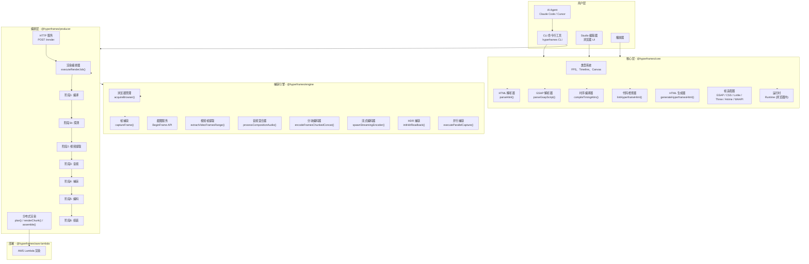
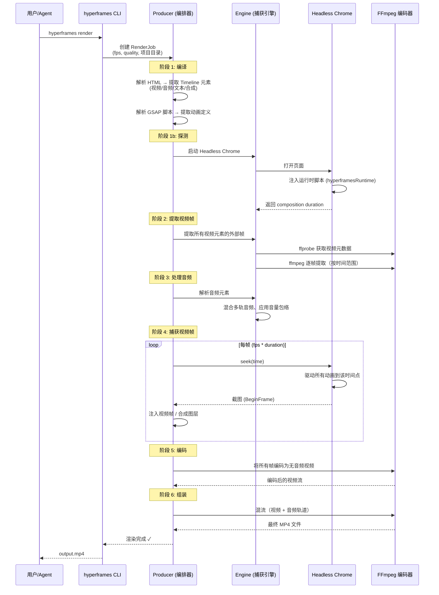
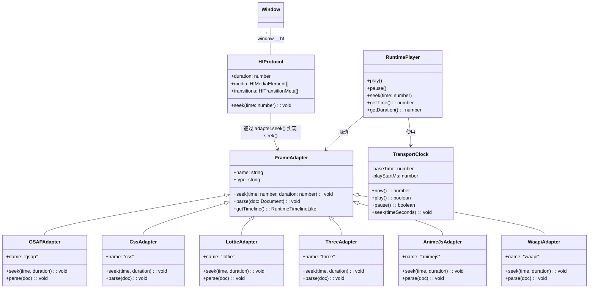

# HyperFrames — 开源 HTML 视频渲染框架

## 1. 项目定位

**HyperFrames** 是一个开源框架，核心理念是 **"Write HTML. Render video."**（编写 HTML，渲染视频）。它让开发者/AI Agent 用 HTML、CSS、JavaScript 编写可定位的动画页面，然后将同一份 HTML 确定性（deterministically）渲染为 MP4 视频文件。由 HeyGen 开源并用于生产环境。

它解决了传统视频制作的痛点：无需掌握 Premiere/After Effects，无需学习 React（像 Remotion 那样），只需写 HTML 就能生成视频。特别适合 AI Agent 自动生成视频内容、自动化内容管线、以及开发者驱动的视频制作场景。

## 2. 核心功能

- **HTML 原生视频创作** — 用 HTML + CSS + 数据属性定义视频合成（composition），无需构建工具
- **确定性渲染** — 相同的 HTML 输入始终产生相同的逐帧输出，适合 CI/回归测试
- **多动画框架适配** — 支持 GSAP、CSS 动画、Lottie、Three.js、Anime.js、WAAPI 等
- **CLI 工具链** — 项目初始化、预览（热重载）、代码检查、渲染输出一条龙
- **浏览器预览** — 在浏览器中实时预览动画，所见即所得
- **音视频处理** — 视频帧注入、音频混合、音量包络、多轨道支持
- **Shader 过渡** — WebGL 着色器过渡效果
- **分布式渲染** — 支持 AWS Lambda 大规模分布式渲染
- **HDR 渲染** — 支持 HDR10/PQ 色域、HDR 视频编码
- **可嵌入播放器** — `<hyperframes-player>` Web Component，可嵌入任何页面
- **Studio 编辑器** — 浏览器端的合成编辑器 UI
- **Agent 技能包** — 教导 AI 编码助手（Claude Code、Cursor 等）理解视频创作模式
- **frame.md 设计系统** — 将品牌设计规范转化为视频创作可用的设计令牌（design tokens）
- **Catalog 组件市场** — 可复用的过渡、叠加层、字幕、图表等组件

## 3. 项目架构

### 3.1 整体架构图



### 3.2 核心渲染流程



### 3.3 运行时协议与页面适配器



## 4. 核心技术栈

| 技术                                                 | 用途                           |
| ---------------------------------------------------- | ------------------------------ |
| **TypeScript**                                 | 全项目使用，强类型系统         |
| **Bun**                                        | 包管理器、构建工具、测试运行器 |
| **Headless Chrome (Puppeteer)**                | HTML 页面渲染和截图捕获        |
| **FFmpeg**                                     | 视频编码、音频混合、帧提取     |
| **Chrome BeginFrame API**                      | 确定性帧捕获（同步帧生成）     |
| **Hono**                                       | Producer HTTP 服务框架         |
| **citty**                                      | CLI 命令定义框架               |
| **linkedom**                                   | 服务端 HTML 解析（轻量 DOM）   |
| **GSAP**                                       | 首推动画库（可定位时间线）     |
| **Three.js / Lottie / CSS / Anime.js / WAAPI** | 其他支持的动画框架             |
| **WebGL**                                      | 着色器过渡效果                 |
| **oxlint / oxfmt**                             | 代码检查与格式化               |
| **tsup**                                       | 构建打包                       |
| **AWS Lambda**                                 | 分布式渲染部署                 |
| **PostgreSQL + Drizzle ORM**                   | Studio 后端数据存储            |
| **Lit**                                        | Web Component（player）        |
| **Vite + React**                               | Studio 前端                    |

## 5. 核心原理

### 5.1 关键设计思想：Seekable Animation（可定位动画）

HyperFrames 最核心的设计是 **"可定位动画"** 而非传统的"逐帧播放"：

```python
def render_video(html_content: str, fps: int, duration: float) -> bytes:
    """
    HyperFrames 视频渲染核心逻辑
  
    不是"逐帧播放并录像"，而是"逐帧定位并截图"。
    每一帧的渲染互相独立，因此可以并行。
    """
    # 1. 准备阶段：在 Chrome 中加载 HTML
    page = open_page(html_content)
    page.inject_runtime_script()  # 注入 hyperframesRuntime
  
    # 2. 获取页面暴露的 seek 协议
    protocol = page.evaluate("window.__hf")
    # protocol = { duration: 10, seek: fn, media: [...] }
  
    # 3. 并行渲染每一帧（帧间无依赖）
    all_frames = []
    total_frames = fps * protocol.duration
  
    for time_s in all_frame_times(fps, protocol.duration):
        # 每一帧都 seek 到精确时间点
        page.evaluate(f"window.__hf.seek({time_s})")
      
        # 注入外部视频帧（浏览器本身不播放 <video>）
        inject_inline_video_frames(page, time_s)
      
        # 截图（BeginFrame 模式：同步生成单帧）
        frame_buffer = page.capture_screenshot()
        all_frames.append(frame_buffer)
  
    # 4. 用 FFmpeg 将帧序列编码为视频
    video_stream = ffmpeg.encode_frames_to_video(all_frames, fps)
  
    # 5. 混合音频轨道
    audio_stream = mix_audio_tracks(protocol.media)
  
    # 6. 混流输出最终 MP4
    return ffmpeg.mux_video_with_audio(video_stream, audio_stream)
```

### 5.2 HTML Composition 数据模型

每个视频合成（composition）就是一个 HTML 页面，通过数据属性定义时间和轨道：

```html
<!-- 合成容器：定义画布尺寸和总时长 -->
<div id="stage" data-composition-id="my-video"
     data-width="1920" data-height="1080">
  
  <!-- 视频轨道：起始时间、持续时长、轨道索引 -->
  <video data-start="0" data-duration="6"
         data-track-index="0" src="intro.mp4"></video>
  
  <!-- 文本元素：带 CSS 动画 -->
  <h1 class="clip" data-start="1" data-duration="4"
      data-track-index="1">标题文字</h1>
  
  <!-- 音频轨道：独立音量控制 -->
  <audio data-start="0" data-duration="6"
         data-track-index="2" data-volume="0.5"
         src="music.wav"></audio>
  
  <!-- 动画脚本：GSAP 时间线（必须挂载到 window.__timelines） -->
  <script>
    const tl = gsap.timeline({ paused: true });
    tl.to("#title", { opacity: 1, y: 0, duration: 0.8 }, 0);
    // 注册到全局，引擎通过 seek(time) → tl.progress() 驱动
    window.__timelines = window.__timelines || {};
    window.__timelines["my-video"] = tl;
  </script>
</div>
```

### 5.3 引擎 — Chrome 的 BeginFrame 模式

```python
def capture_frame_in_beginframe_mode(page, time_s: float) -> bytes:
    """
    Chrome 的 BeginFrame 模式是确定性渲染的关键。
  
    普通截图（pageScreenshotCapture）：
      - 依赖 GPU 渲染管线完成，时间不可控
      - 适合低帧率/快速预览
  
    BeginFrame 模式（beginFrameCapture）：
      - 通过 Chrome DevTools Protocol (CDP) 的
        Page.beginFrame 同步生成单帧
      - 绕过操作系统合成器，帧生成完全由 CPU 驱动
      - 每帧渲染时间一致，适合高帧率/确定性捕获
    """
    # 1. 如果启用 BeginFrame 模式
    if use_beginframe:
        # 发送 CDP 命令生成一帧
        cdp_session.send("Page.beginFrame", {
            "frameTime": calculate_frame_timestamp(time_s),
            "screenshot": {
                "format": "png",
                "quality": 100
            }
        })
        return cdp_session.receive_screenshot()
    else:
        # 回退到普通截图
        return page.screenshot({ type: "png" })
```

### 5.4 帧适配器机制 — 框架无关的 seek

```python
class FrameAdapter:
    """
    帧适配器是 HyperFrames 的核心抽象。
  
    任何动画库只要能响应 seek(time) 调用，就能与 HyperFrames 集成。
    适配器将不同动画库的"时间线"概念统一为可定位的 seek 操作。
    """
    def seek(self, time: float, duration: float):
        """
        将动画驱动到指定的时间点。
      
        GSAP 适配器实现：
          timeline.progress(time / duration, { suppressEvents: true })
      
        CSS 适配器实现：
          element.style.animationDelay = f"-{time}s"
          element.style.animationPlayState = "paused"
      
        Lottie 适配器实现：
          animation.goToFrame(time * fps, { force: true })
      
        Three.js 适配器实现：
          mixer.setTime(time)
          renderer.render(scene, camera)
        """
        raise NotImplementedError

    def parse(self, doc: Document):
        """
        从文档中解析适配器需要的配置信息。
      
        GSAP 适配器解析：
          查找 window.__timelines 中所有 GSAP 时间线
      
        CSS 适配器解析：
          查找所有带有 animation-* CSS 属性的元素
        """
        raise NotImplementedError
```

### 5.5 时序编译器

```python
def compile_timing_attrs(html_doc: Document) -> List[ResolvedElement]:
    """
    编译器负责从 HTML 的 data-* 属性中提取时序信息。
  
    支持的属性：
      data-start        → 元素在合成中的开始时间（秒）
      data-duration     → 元素持续时长（秒）
      data-track-index  → 轨道索引（决定渲染层级）
      data-volume       → 音量 (0-1)
      data-layer        → z-index
      data-media-offset → 媒体文件内部的偏移量
      data-composition-id → 子合成标识
    """
    elements = []
    for el in html_doc.query_all("[data-start]"):
        elements.append({
            "id": el.id,
            "type": resolve_element_type(el),
            "start_time": float(el.get_attribute("data-start")),
            "duration": float(el.get_attribute("data-duration")),
            "track_index": int(el.get_attribute("data-track-index") or 0),
            "volume": float(el.get_attribute("data-volume") or 1.0),
            "src": el.get_attribute("src"),
        })
    return elements
```

### 5.6 关键设计决策

| 决策                 | 选择                                | 理由                                                 |
| -------------------- | ----------------------------------- | ---------------------------------------------------- |
| **创作范式**   | HTML + data 属性 vs React 组件      | HTML 对 AI Agent 更友好，无需构建步骤                |
| **帧捕获**     | BeginFrame API vs 实时屏幕录制      | 确定性输出、每帧独立可并行                           |
| **动画引擎**   | 适配器模式 vs 绑定单一引擎          | 支持 GSAP/CSS/Lottie/Three.js 等任意动画库           |
| **视频处理**   | 外部帧注入 vs 依赖浏览器播放        | 浏览器在无头模式下无法可靠播放视频                   |
| **帧率表示**   | 有理数 (num/den) vs 浮点数          | 精确处理 NTSC 帧率 (30000/1001)                      |
| **本地渲染**   | 本地 + Docker vs 纯云端             | 开发者本地调试方便，Docker 确保 CI 一致性            |
| **编排策略**   | 6 阶段管线 vs 单步执行              | 分离关注点：编译→探测→提取→音频→捕获→编码→组装 |
| **运行时注入** | 通过 evaluateOnNewDocument 注入脚本 | 在页面脚本执行前注入运行时，确保动画可定位           |

## 6. 目录结构

```
hyperframes/
├── package.json              # monorepo 根配置（Bun workspaces）
├── CLAUDE.md                 # 项目开发指南
├── Dockerfile.test           # 回归测试 Docker 镜像
├── packages/
│   ├── cli/                  # hyperframes CLI
│   │   └── src/
│   │       ├── cli.ts        # CLI 入口（定义所有子命令）
│   │       ├── commands/     # 各命令实现
│   │       │   ├── init.ts        # hyperframes init
│   │       │   ├── preview.ts     # hyperframes preview
│   │       │   ├── render.ts      # hyperframes render
│   │       │   ├── lint.ts        # hyperframes lint
│   │       │   ├── add.ts         # catalog 组件安装
│   │       │   ├── inspect.ts     # 合成检查
│   │       │   ├── capture.ts     # 网页抓取转项目
│   │       │   └── ...            # 其他 20+ 命令
│   │       ├── capture/     # 网页抓取工具
│   │       └── auth/        # OAuth 认证
│   │
│   ├── core/                # 核心类型、解析器、运行时
│   │   └── src/
│   │       ├── core.types.ts          # 核心类型定义
│   │       ├── parsers/               # HTML/GSAP 解析器
│   │       ├── runtime/               # 浏览器端运行时
│   │       │   ├── entry.ts           # 运行时入口
│   │       │   ├── init.ts            # 运行时初始化
│   │       │   ├── clock.ts           # TransportClock
│   │       │   ├── player.ts          # RuntimePlayer
│   │       │   ├── adapters/          # 帧适配器
│   │       │   └── state.ts           # 运行时状态
│   │       ├── lint/                  # 代码检查规则
│   │       ├── generators/            # HTML 生成器
│   │       ├── compiler/              # 时序编译器
│   │       ├── inline-scripts/        # 注入页面的脚本
│   │       └── templates/             # HTML 模板
│   │
│   ├── engine/              # 捕获引擎
│   │   └── src/
│   │       ├── types.ts     # HfProtocol 类型
│   │       ├── config.ts    # 引擎配置
│   │       ├── services/
│   │       │   ├── browserManager.ts      # Chrome 进程/池管理
│   │       │   ├── frameCapture.ts        # 帧捕获会话
│   │       │   ├── screenshotService.ts   # BeginFrame/截图服务
│   │       │   ├── chunkEncoder.ts        # FFmpeg 编码器
│   │       │   ├── streamingEncoder.ts    # 流式编码
│   │       │   ├── videoFrameExtractor.ts # 视频帧提取
│   │       │   ├── videoFrameInjector.ts  # 视频帧注入
│   │       │   ├── audioMixer.ts          # 音频混合
│   │       │   ├── hdrCapture.ts          # HDR 捕获
│   │       │   ├── parallelCoordinator.ts # 并行帧捕获
│   │       │   └── fileServer.ts          # 文件服务
│   │       └── utils/
│   │           ├── runFfmpeg.ts           # FFmpeg 调用
│   │           ├── ffprobe.ts             # 媒体探测
│   │           ├── alphaBlit.ts           # Alpha 合成
│   │           ├── layerCompositor.ts     # 图层合成
│   │           ├── shaderTransitions.ts   # Shader 过渡
│   │           └── hdr.ts                 # HDR 工具
│   │
│   ├── producer/            # 渲染管线编排
│   │   └── src/
│   │       ├── index.ts           # 导出
│   │       ├── server.ts          # HTTP 服务
│   │       ├── config.ts          # 配置
│   │       ├── distributed.ts     # 分布式渲染
│   │       ├── services/
│   │       │   ├── renderOrchestrator.ts  # 6 阶段编排器
│   │       │   ├── render/
│   │       │   │   ├── stages/            # 各阶段实现
│   │       │   │   │   ├── compileStage.ts
│   │       │   │   │   ├── probeStage.ts
│   │       │   │   │   ├── extractVideosStage.ts
│   │       │   │   │   ├── audioStage.ts
│   │       │   │   │   ├── captureStage.ts
│   │       │   │   │   ├── encodeStage.ts
│   │       │   │   │   └── assembleStage.ts
│   │       │   │   ├── cleanup.ts
│   │       │   │   ├── hdrMode.ts
│   │       │   │   └── perfSummary.ts
│   │       │   ├── hyperframeLint.ts     # 合成检查
│   │       │   └── ...
│   │       └── tests/          # 回归测试基线
│   │
│   ├── player/              # Web Component 播放器
│   │   └── src/
│   │       ├── hyperframes-player.ts # Lit Web Component
│   │       ├── controls.ts          # 播放控制 UI
│   │       ├── playback-state.ts    # 播放状态管理
│   │       └── runtime-message-handler.ts
│   │
│   ├── studio/              # 浏览器编辑器
│   │   └── src/             # React + Vite
│   │
│   ├── shader-transitions/  # WebGL Shader 过渡
│   │
│   └── aws-lambda/          # AWS Lambda 部署
│
├── docs/                    # 文档站点
├── skills/                  # AI Agent 技能
└── scripts/                 # 工具脚本
```

## 7. 运行方式

### 快速开始

```bash
# 安装（通过 npx 即可使用）
npx hyperframes init my-video
cd my-video

# 在浏览器中预览（带热重载）
npx hyperframes preview

# 渲染为 MP4
npx hyperframes render
```

**环境要求:** Node.js 22+、FFmpeg

### 开发本项目

```bash
git clone https://github.com/heygen-com/hyperframes.git
cd hyperframes
bun install           # 安装依赖
bun run build         # 构建所有包
bun run test          # 运行测试
```

### 作为服务运行

```bash
# 启动 HTTP 渲染服务（Producers Server）
npx hyperframes server
# 或直接
node packages/producer/dist/public-server.js
# POST /render 提交渲染任务
```

### AI Agent 使用

```bash
# 安装 HyperFrames 技能
npx skills add heygen-com/hyperframes

# 然后 Agent 就能理解视频创作指令
# "创建一个10秒的产品介绍视频，带淡入标题、背景视频和背景音乐"
```

## 8. 项目亮点

1. **HTML 原生 vs React 绑定** — 与 Remotion 最大的区别：HyperFrames 用纯 HTML，无需构建步骤，Agent 和人类都能轻松编写
2. **确定性渲染** — 同一份 HTML 始终产生相同的逐帧结果，这是自动化管线（CI/CD、回归测试、批量渲染）的基石
3. **并行帧捕获** — 由于每帧通过 `seek()` 独立定位，可以将不同帧分配到不同的 Chrome 实例并行渲染，大幅提升渲染速度
4. **理性的帧率模型** — 用 `{num, den}` 有理数精确表示 NTSC 帧率（`30000/1001`），避免浮点数精度丢失
5. **适配器架构** — 动画库无关的设计，GSAP/Lottie/Three.js/CSS 等通过统一 `FrameAdapter` 接口集成
6. **注入式视频处理** — 不在浏览器中播放视频（无头模式下不可靠），而是在引擎层面提取帧并注入到页面中
7. **BeginFrame 模式** — 利用 Chrome DevTools Protocol 的 `Page.beginFrame` 同步生成单帧，区别于传统的实时录制模式
8. **HDR 全链路** — 从 HDR 帧捕获到 HDR10 PQ 编码的完整流水线
9. **分布式渲染** — 渲染管线被拆分为 plan/renderChunk/assemble 三阶段，天然适配 AWS Lambda 无服务器架构
10. **Agent 原生友好** — CLI 的非交互式设计、技能包、HTML 创作模型，使 AI Agent 能完整自主地完成视频创作循环
